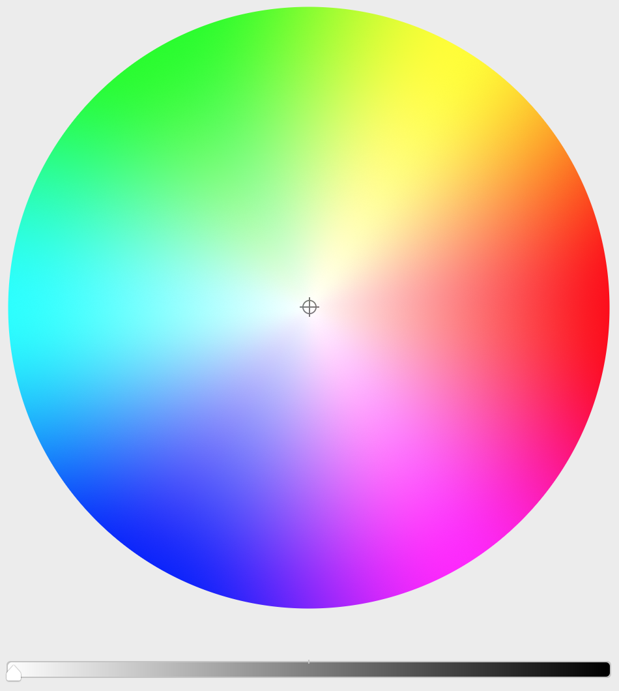

# NOC-kadai

### 具体的なアイディア
iOS用のカラーピッカー。  
HSV色相環を表示し、指のドラッグ操作によって色を選択できるもの。

↓カラーピッカーの例(Xcode内のカラーピッカー)

この例では、HSVのH(Hue: 色素)とS(Saturation: 彩度)は円で、V(Value: 明度)はスライダーで表現している。

上のようなカラーピッカーは、iOSのSDKには提供されていない。もし１から実装するならば、H(Hue: 色素)とS(Saturation: 彩度)の円の実装が大変だと思う。
そのため、その円を描画してドラッグ操作によって色を取得できるコンポーネントを、ライブラリとして実装したい。
### そのライブラリはどのような問題を解決しようとしているか
問題と解決
- 赤青黄など大まかな色しか選択できない
→ HSV色相環によって、細かい色を選択できる
- 直感的に色を選択したい
→ ドラッグ操作によって、直感的に色を選択できる
- 色の各要素を指定して、色を選ぶのは面倒
→ ドラッグ操作によって、一度に色を選択できる

### 似たようなライブラリはすでにあるか(あればURL)
- [EyreFree/EFColorPicker](https://github.com/EyreFree/EFColorPicker)
- [gizmosachin/ColorSlider](https://github.com/gizmosachin/ColorSlider)
- [RastislavMirek/FlexColorPicker](https://github.com/RastislavMirek/FlexColorPicker)
- [joncardasis/ChromaColorPicker](https://github.com/joncardasis/ChromaColorPicker)
- [louisdh/huekit](https://github.com/louisdh/huekit)

### 似たようなライブラリがある場合、自身で作成するライブラリの優位性はどの部分になるか
似たようなライブラリの課題
- カラーピッカーが、View Controller(画面)単位で用意されていて、ライブラリ使用者がカスタマイズし辛い
  - 画面単位で用意されている場合、カラーピッカーがコンポーネントとして利用できない
- カラーピッカーのインタラクションのアニメーションが、すでに実装されていて、ライブラリ使用者が、アニメーションのカスタマイズができない

自身で作成するライブラリの優位性(上記の課題の解決)
- カラーピッカーをコンポーネントとして実装することで、ライブラリ使用者が、カラーピッカーを自由に画面に組み込むことができる
- アニメーションの実装はせず、ライブラリ使用者がアニメーションのカスタマイズできるようにする

### その他
#### 参考・調査
- HSVモデルは、人間から見て直感的に色を指定しやすいらしい
  - [HSV色空間#HSVと色覚 - Wikipedia](https://ja.wikipedia.org/wiki/HSV%E8%89%B2%E7%A9%BA%E9%96%93#HSV%E3%81%A8%E8%89%B2%E8%A6%9A)
  - [HSVとは - ピクシブ百科事典](https://dic.pixiv.net/a/HSV)
  - [HSV色空間とは - PEKO STEP](https://www.peko-step.com/html/hsv.html)
- `AppKit`では、カラーピッカーが提供されているため、実装や設計の参考になるかも
  - [NSColorPanel - Apple Developer Documentation](https://developer.apple.com/documentation/appkit/nscolorpanel)
  - [NSColorPicker - Apple Developer Documentation](https://developer.apple.com/documentation/appkit/nscolorpicker)
  - [Choosing Colors With Color Wells and Color Panels - Apple Developer Documentation](https://developer.apple.com/library/archive/documentation/Cocoa/Conceptual/DrawColor/Tasks/ChoosingColorPickers.html)
  - [Choosing the Color Pickers in a Color Panel - Apple Developer Documentation](https://developer.apple.com/library/archive/documentation/Cocoa/Conceptual/DrawColor/Tasks/ChoosingColorPickers.html#//apple_ref/doc/uid/20000792-BAJBFGED)
#### 悩み・技術的課題
- H(Hue: 色素)とS(Saturation: 彩度)のグラデーションの描画の方法がわからない
  - 描画できない場合は、画像でグラデーションを用意するしかない？
  - 円での描画が難しいならば、長方形等描画方法を変えるしかない？
- ドラッグ操作による色の取得は、描画したグラデーションとドラッグした座標から計算することになる？
- 実装の設計はまだしていないが、ライブラリとしてどこまでのクラスを公開するべきかわからない
- OSSのライブラリとして、どのライセンスで公開するべきかわからない

